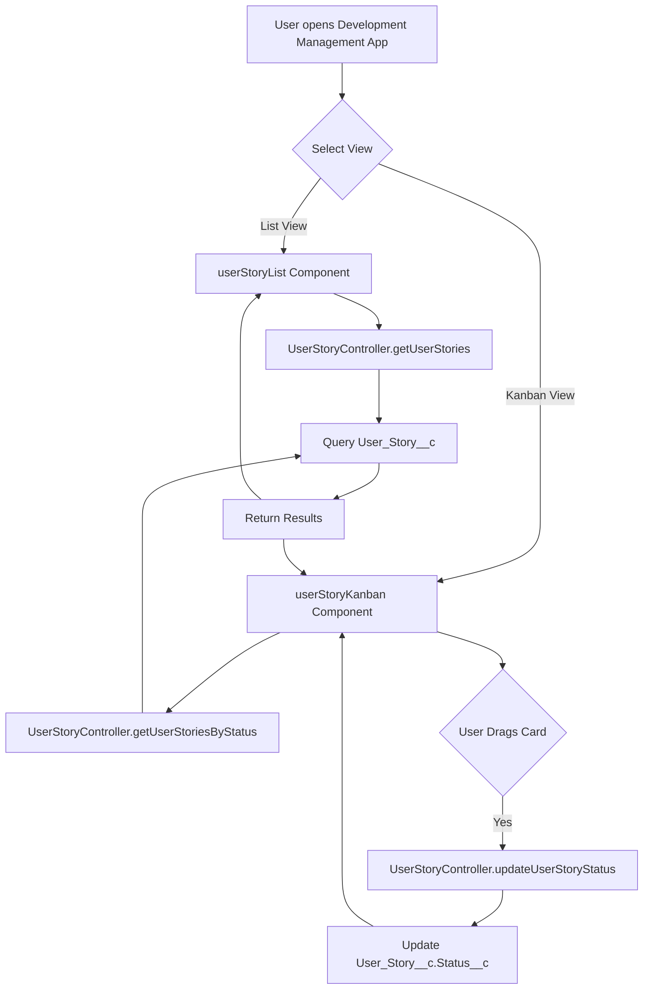

# User Story Management App Development Plan

## Overview

Build a custom Salesforce app for managing development user stories organized by features. The app will include custom objects, Lightning Web Components for list and Kanban views, Apex controllers, and proper security configuration.

## Architecture

### Data Model

- **Feature__c** (Custom Object): Organizes user stories by feature
  - Fields: Name, Description__c (Long Text Area), Status__c (Picklist: Planning, In Progress, Completed)

- **User_Story__c** (Custom Object): Individual user stories
  - Fields: Name (Title), Description__c (Long Text Area), Status__c (Picklist: Backlog, In Progress, In Review, Done, Blocked), Priority__c (Picklist: Low, Medium, High, Critical), Assignee__c (Lookup to User), Feature__c (Master-Detail to Feature__c), Acceptance_Criteria__c (Long Text Area)

### Components Structure

```
force-app/main/default/
├── objects/
│   ├── Feature__c/
│   │   ├── Feature__c.object-meta.xml
│   │   ├── fields/
│   │   │   ├── Description__c.field-meta.xml
│   │   │   └── Status__c.field-meta.xml
│   │   ├── listViews/
│   │   │   └── All_Features.listView-meta.xml
│   │   └── layouts/
│   │       └── Feature__c-Feature Layout.layout-meta.xml
│   └── User_Story__c/
│       ├── User_Story__c.object-meta.xml
│       ├── fields/
│       │   ├── Description__c.field-meta.xml
│       │   ├── Status__c.field-meta.xml
│       │   ├── Priority__c.field-meta.xml
│       │   ├── Assignee__c.field-meta.xml
│       │   ├── Feature__c.field-meta.xml
│       │   └── Acceptance_Criteria__c.field-meta.xml
│       ├── listViews/
│       │   ├── All_User_Stories.listView-meta.xml
│       │   ├── My_User_Stories.listView-meta.xml
│       │   └── Backlog.listView-meta.xml
│       └── layouts/
│           └── User_Story__c-User Story Layout.layout-meta.xml
├── classes/
│   ├── UserStoryController.cls
│   ├── UserStoryController.cls-meta.xml
│   ├── UserStoryControllerTest.cls
│   └── UserStoryControllerTest.cls-meta.xml
├── lwc/
│   ├── userStoryList/
│   │   ├── userStoryList.html
│   │   ├── userStoryList.js
│   │   ├── userStoryList.css
│   │   └── userStoryList.js-meta.xml
│   └── userStoryKanban/
│       ├── userStoryKanban.html
│       ├── userStoryKanban.js
│       ├── userStoryKanban.css
│       └── userStoryKanban.js-meta.xml
├── flexipages/
│   ├── User_Story_List_Page.flexipage-meta.xml
│   ├── User_Story_Kanban_Page.flexipage-meta.xml
│   └── Feature_Record_Page.flexipage-meta.xml
├── applications/
│   └── Development_Management.app-meta.xml
├── tabs/
│   ├── Feature__c.tab-meta.xml
│   └── User_Story__c.tab-meta.xml
└── permissionsets/
    └── Development_Management_Access.permissionset-meta.xml
```

## Implementation Details

### 1. Custom Objects & Fields

- ✅ Create `Feature__c` object with standard and custom fields
  - **Note**: User_Story__c related list was intentionally omitted from Feature__c layout during initial creation to avoid validation errors. It will be added after User_Story__c object is created.
- Create `User_Story__c` object with Master-Detail relationship to `Feature__c`
- Add User_Story__c related list to Feature__c layout after User_Story__c object exists
- Configure field-level security and validation rules
- Set up list views with filters for common use cases

### 2. Apex Controller (`UserStoryController.cls`)

- `getUserStories(String featureId, String status)` - Query user stories with filtering
- `getUserStoriesByStatus()` - Group user stories by status for Kanban
- `updateUserStoryStatus(Id storyId, String newStatus)` - Update status (for Kanban drag-and-drop)
- `getFeatures()` - Query all features for filtering
- Implement `WITH SECURITY_ENFORCED` for all queries
- Include proper error handling and input validation

### 3. Lightning Web Components

#### `userStoryList` Component

- Display user stories in a data table with sorting and filtering
- Filter by Feature, Status, Priority, Assignee
- Pagination support
- Link to record detail pages
- Use `lightning-datatable` base component

#### `userStoryKanban` Component

- Kanban board with columns for each status
- Drag-and-drop to change status
- Cards show Title, Priority, Assignee, Feature
- Click card to navigate to record detail
- Use SLDS styling for board layout

### 4. Lightning Pages

- **User Story List Page**: Home page with list component and filters
- **User Story Kanban Page**: Alternative view with Kanban component
- **Feature Record Page**: Shows feature details with related list of user stories

### 5. Custom App

- Create "Development Management" app
- Include Feature and User Story tabs
- Configure app navigation and utility items
- Set default landing page to User Story List

### 6. Security & Permissions

- Create permission set `Development_Management_Access`
- Configure object and field-level permissions
- Set up sharing rules if needed for team collaboration

### 7. Testing

- Apex unit tests with 80%+ code coverage
- Test all controller methods including error cases
- Test security enforcement
- Jest tests for LWC components (if time permits)

## Data Flow



## Key Files to Create/Modify

### New Files

- ✅ `force-app/main/default/objects/Feature__c/Feature__c.object-meta.xml` (completed)
- ✅ `force-app/main/default/objects/Feature__c/fields/Description__c.field-meta.xml` (completed)
- ✅ `force-app/main/default/objects/Feature__c/fields/Status__c.field-meta.xml` (completed)
- ✅ `force-app/main/default/objects/Feature__c/listViews/All_Features.listView-meta.xml` (completed)
- ✅ `force-app/main/default/objects/Feature__c/layouts/Feature__c-Feature Layout.layout-meta.xml` (completed - User_Story__c related list to be added later)
- `force-app/main/default/objects/User_Story__c/User_Story__c.object-meta.xml`
- `force-app/main/default/classes/UserStoryController.cls`
- `force-app/main/default/lwc/userStoryList/userStoryList.*`
- `force-app/main/default/lwc/userStoryKanban/userStoryKanban.*`
- `force-app/main/default/applications/Development_Management.app-meta.xml`
- `force-app/main/default/permissionsets/Development_Management_Access.permissionset-meta.xml`

### Files to Modify

- `force-app/main/default/objects/Feature__c/layouts/Feature__c-Feature Layout.layout-meta.xml` - Add User_Story__c related list after User_Story__c object is created

### Reference Existing Patterns

- Follow patterns from `ExperienceController.cls` for Apex structure
- Follow patterns from `recentExperiences` LWC for component structure
- Use similar permission set structure as `Sales_Experience_Access.permissionset-meta.xml`

## Success Criteria

- Users can create and manage Features
- Users can create User Stories linked to Features
- Users can view User Stories in list format with filtering
- Users can view User Stories in Kanban format
- Users can update User Story status via drag-and-drop in Kanban
- All code has 80%+ test coverage
- App is accessible via custom app launcher entry
- Security is properly configured with permission sets